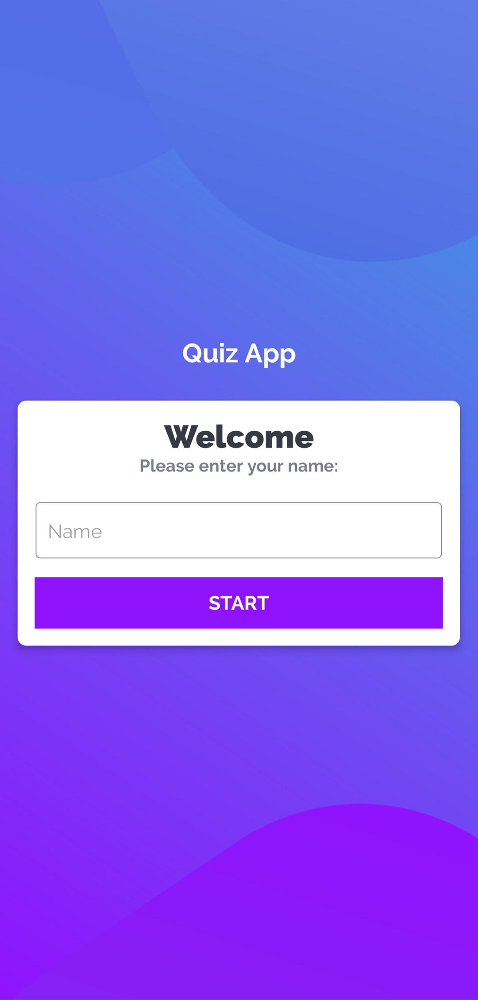
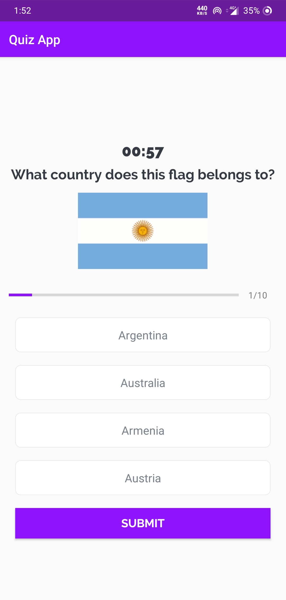
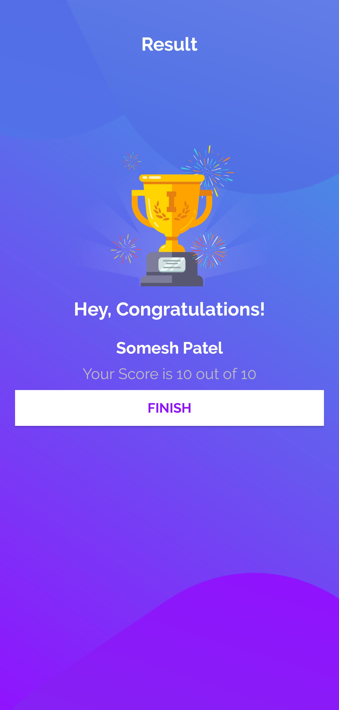

# QuizApp
Knowledge is power. Test your General Knowledge! A fun quiz of world maps. It consists of 10 world maps or questions with 4 options, a countdown timer, etc. It is an android app made using Kotlin. 

Sẽ không giống , chỉ time khảo 
https://www.youtube.com/watch?v=b21fiIyOW4A&t=2215s

# Screenshots

         
